# Flux backend d'un tour de jeu — MJ virtuel

## Document de référence technique

**Objet** : décrire, sous forme d'organigrammes, le fonctionnement **cible** du backend une
fois la roadmap achevée (Phase 9) — de l'action écrite par le joueur jusqu'à la réponse finale
reçue par le front.

**Ce que ce document n'est pas** : une nouvelle source de décisions. Il assemble ce qui est
déjà tranché dans les autres documents, qui restent la source de vérité. En cas de
divergence, ce sont eux qui font foi. Les renvois entre crochets pointent vers eux :

- [archi §x] — `architecture-mj-virtuel-llm.md`
- [BDD] — `base-de-donnees-mj-virtuel-postgresql.md`
- [règles §x] — `systeme-regles-jeu-mj-virtuel.md`
- [roadmap Px] — `roadmap-mj-virtuel-llm.md`
- [front §x] — `cahier-des-charges-front-mj-virtuel.md`

Les éléments encore ouverts sont signalés comme tels, en fin de document et dans les
diagrammes (libellé *« à trancher »*).

**Lecture des diagrammes** :

| Forme | Signification |
|---|---|
| Rectangle | Traitement déterministe du backend |
| Hexagone `{{ }}` | Appel au LLM (via le LLM Gateway) |
| Losange | Décision du backend |
| Cylindre | Lecture ou écriture PostgreSQL |
| Parallélogramme `[/ /]` | Événement SSE envoyé au front |
| Arrondi | Entrée ou sortie du flux |

Les identifiants (tables, colonnes, événements, champs JSON) sont en anglais, comme dans le
code.

---

## 1. Vue d'ensemble

Un tour se déroule en **deux temps** découplés par la file de jobs :

1. **La soumission**, synchrone, dans un process HTTP : elle enregistre le tour et répond
   immédiatement `202`.
2. **L'exécution**, asynchrone, dans un worker : elle joue le pipeline et informe le front
   par SSE au fil des étapes.

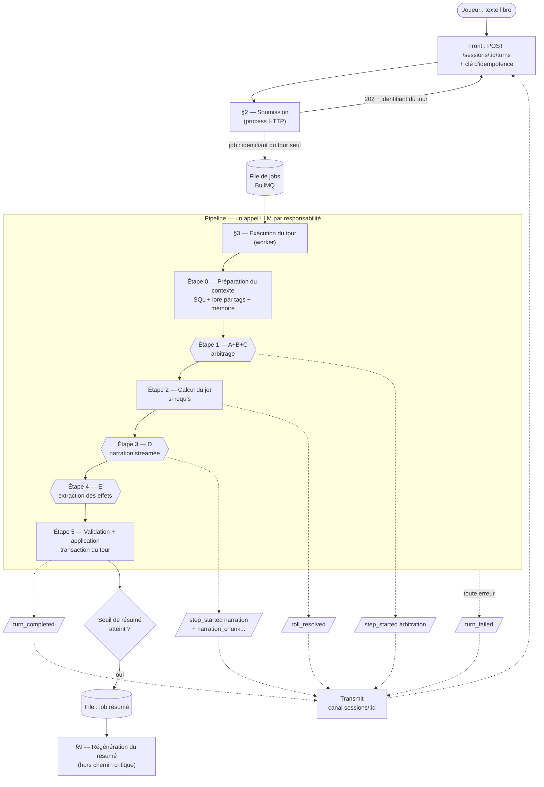

**Invariants qui traversent tout le flux** [CLAUDE.md, archi §7] :

- **Le LLM propose, le backend décide** : dés, seuils, formules et écriture du state sont
  déterministes, côté backend.
- **Aucune confiance dans une sortie LLM** : toute sortie structurée est validée avant usage.
- **Listes fermées** : le LLM ne désigne une entité (compétence, catégorie d'action, PNJ,
  lieu, objet, flag) que par une référence issue d'une liste transmise dans le contexte.
- **Le narrateur ne voit jamais de chiffres** : uniquement `result` + marge qualitative.
- **Tout en anglais en interne** : seule la narration (D) est produite dans la langue du
  joueur.
- **Rien de ce qui garantit l'intégrité d'un tour ne dépend de la file** : idempotence,
  sérialisation et événements SSE vivent dans le code du tour et en base.

---

## 2. Soumission — process HTTP

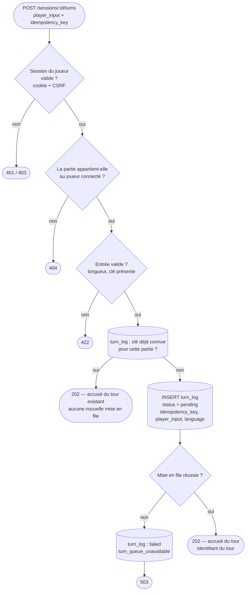

- **La clé est enregistrée avant la mise en file** : un doublon arrivant pendant l'exécution
  du tour retrouve la ligne `pending` et reçoit le même accusé [roadmap P2].
- **Aucun numéro de tour à ce stade** : il est attribué dans la transaction qui applique les
  effets. Un tour `pending` ou `failed` n'en a jamais [roadmap P2, KAN-17].
- **Le job ne transporte que l'identifiant du tour** ; tout le reste est relu en base par le
  worker.
- Le front s'est abonné au canal `sessions/:id` **avant** de soumettre : aucun événement ne
  peut partir avant l'abonnement [archi §8bis].

---

## 3. Exécution — prise en charge par le worker

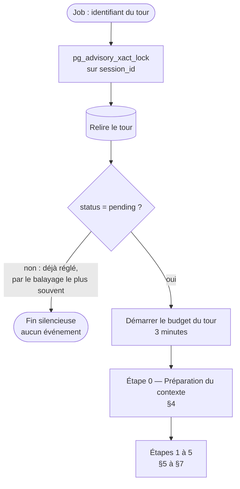

- **Sérialisation par partie** : un verrou PostgreSQL par `session_id` garantit que deux tours
  d'une même partie ne s'exécutent jamais en même temps, quel que soit le nombre de workers
  [archi §8bis]. Deux parties différentes s'exécutent en parallèle.
- **Budget de temps** : chaque appel LLM reçoit un `AbortSignal` limité à
  `min(timeout d'un appel, temps restant)`. Budget épuisé = échec `llm_timeout` [archi §8bis].
- **Pas de retry de la file** : un job échoué ne rejoue jamais ; c'est le joueur qui soumet à
  nouveau, avec une nouvelle clé.

---

## 4. Étape 0 — Préparation du contexte

Trois natures de données, trois mécanismes de sélection — jamais confondus [archi §4].

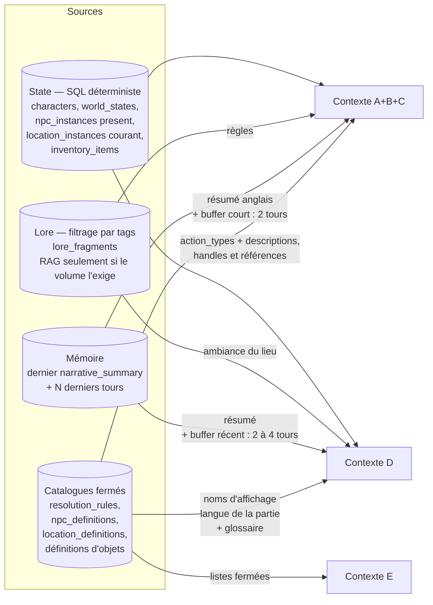

| Étape | Lore | State | Mémoire | Catalogues |
|---|---|---|---|---|
| A+B+C | Règles ciblées par les tags | Scène : lieu courant, PNJ présents, objets pertinents (références anglaises, **sans valeurs mécaniques ni valeurs de compétence**) | Résumé anglais + buffer court (2 derniers tours, langue du joueur) | `action_types` avec descriptions |
| Calcul du jet | — | Compétence du personnage, inventaire complet avec effets mécaniques | — | `resolution_rules` |
| D | Ambiance liée au lieu | Scène complète | Résumé + buffer récent (2–4 tours, langue du joueur) | Noms d'affichage dans la langue de la partie, glossaire |
| E | Aucun | Handles présents, schéma des effets autorisés (pas les valeurs actuelles) | Aucune | Listes fermées de définitions (PNJ, lieux, objets, flags) |

Toutes les sélections sont déterministes : aucune n'est déléguée au LLM.

---

## 5. Étape 1 — A+B+C : arbitrage

### 5.1 Toute étape à sortie JSON — la nouvelle tentative unique

Ce mécanisme s'applique à l'arbitrage (A+B+C) comme à l'extraction (E) [archi §7].

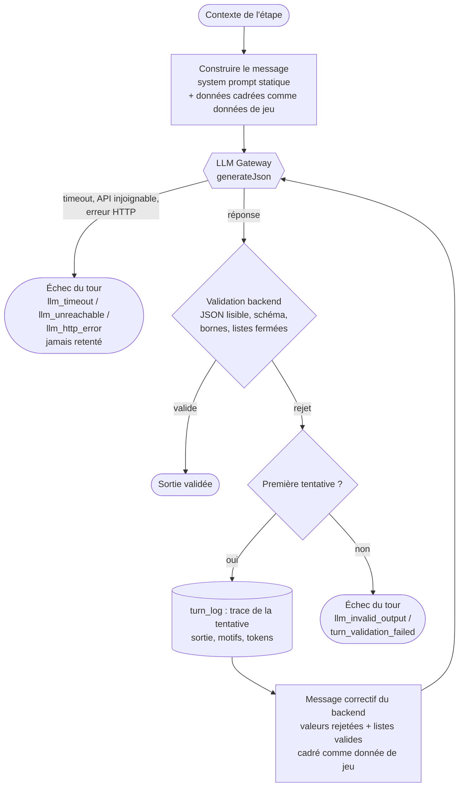

### 5.2 Arbitrage

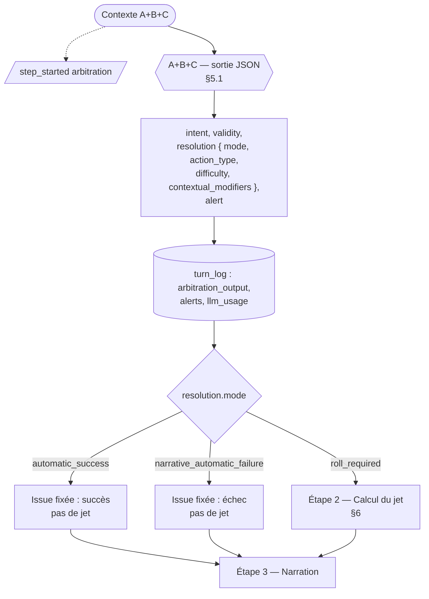

- **L'arbitrage ne narre jamais** et ne produit aucun chiffre de règle [archi §6].
- **`action_type`**, pas de compétence : le backend déduit la compétence via
  `resolution_rules` [BDD].
- **Au plus 2 à 3 modificateurs contextuels**, jamais un modificateur d'objet [règles §5].
  *À trancher en Phase 4 : le chiffrage des modificateurs contextuels (valeur proposée par le
  LLM, ou label qualitatif converti par le backend).*
- **`alert.prompt_injection_suspected`** est enregistré dans `turn_log.alerts`. L'action
  suspecte est traitée comme invalide, mais **la sécurité ne repose pas sur cette détection** :
  le confinement est assuré par la validation backend, qui ne fait jamais confiance au modèle
  [roadmap, stratégie de test].
- **Le joueur n'est jamais bridé** : une action imprudente ou immorale est résolue
  normalement, jamais refusée [règles §10].

---

## 6. Étape 2 — Calcul du jet (backend, aucun LLM)

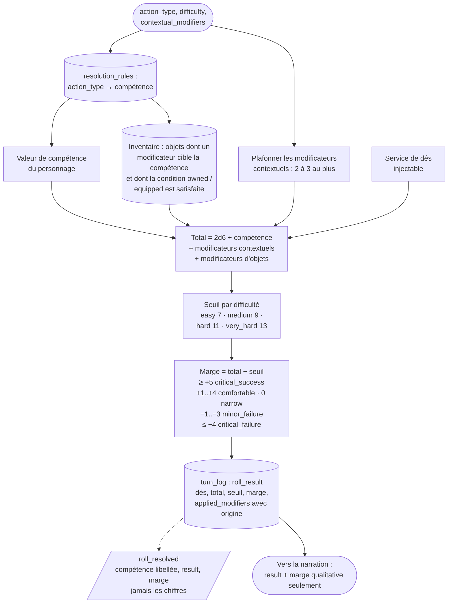

- **Dégâts** (combat, Phase 8) : dégâts de base de l'arme + marge ÷ 2 arrondie au supérieur,
  sans second jet [règles §7].
- **Combat** : aucun sous-système dédié ; un round est un tour normal de ce pipeline, avec le
  même moteur pour le joueur et les PNJ [règles §8]. *À trancher en Phase 8 : la cible d'un jet
  opposé contre un PNJ improvisé pas encore instancié* [roadmap P8].

---

## 7. Étapes 3 à 5 — Narration, extraction, application

### 7.1 Narration (D), streamée

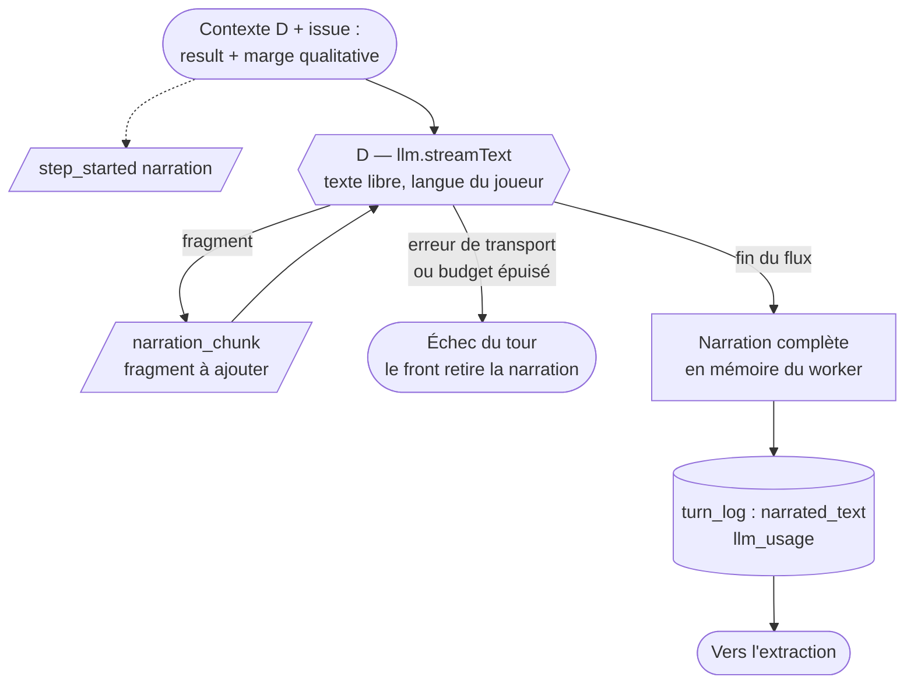

- La narration diffusée est **provisoire** jusqu'à `turn_completed` [archi §8bis].
- Les fragments ne sont jamais persistés ; un front reconnecté en cours de narration attend
  `turn_completed`.
- Le narrateur est libre d'évoquer qui et quoi il veut ; seule l'extraction décide de ce qui
  **existe** mécaniquement.

### 7.2 Extraction (E)

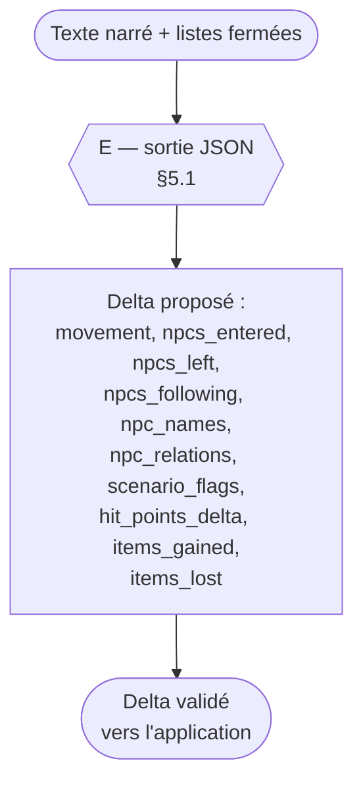

La nouvelle tentative de l'extraction **ne relance jamais la narration** : elle travaille sur
le texte déjà produit.

### 7.3 Validation finale et application — la transaction du tour

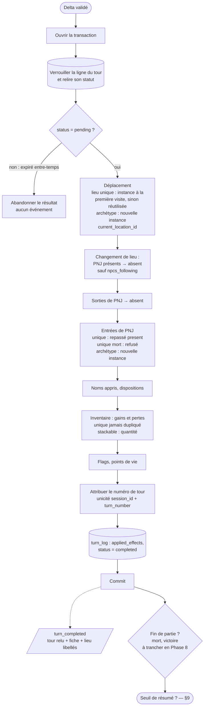

- **Ordre d'application déterministe** : déplacement, puis sorties, puis entrées, pour qu'un
  PNJ qui entre dans le nouveau lieu ne soit pas aussitôt marqué absent [KAN-39].
- **`turn_completed` n'est émis qu'après le commit** ; il porte le tour sous la forme de la
  route de lecture, avec toutes les références transformées en `{ reference, label }` dans la
  langue de la partie [archi §8bis, CLAUDE.md].
- **Tout ou rien** : un échec à n'importe quel point de la transaction l'annule ; rien n'est
  appliqué et le tour passe `failed`.

---

## 8. Chemins d'échec et filets de sécurité

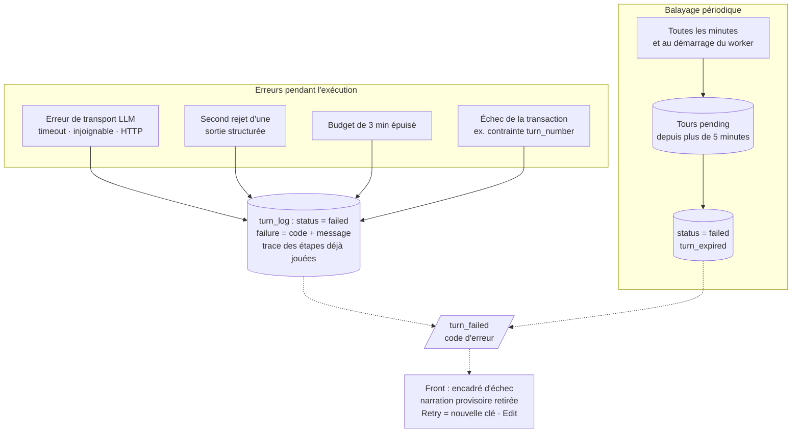

- **Un tour se termine toujours par exactement un** `turn_completed` ou `turn_failed`
  [archi §8bis].
- **Le balayage ne rattrape jamais un tour vivant** : le budget (3 min) est plus court que son
  délai (5 min) [archi §8bis]. Il ne rattrape que les tours orphelins (worker arrêté, job
  perdu).
- **Rattrapage côté front** : un client qui a manqué des événements relit le tour par
  `GET /sessions/:id/turns/:turnId`. Pas de rejeu d'événements côté serveur.
- **Un envoi SSE raté ne fait jamais échouer un tour** : le front rattrape en relisant.
- Chaque code d'erreur a sa traduction côté front [front §5.3.6].

---

## 9. Hors chemin critique — résumé narratif

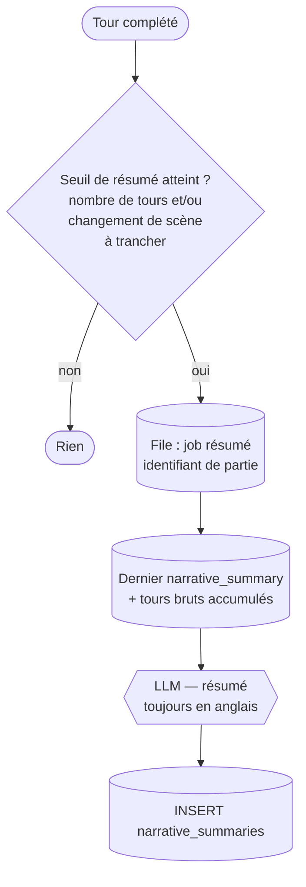

Ce job ne bloque jamais la réponse au joueur, et il n'émet aucun événement SSE [archi §5].

---

## 10. Séquence complète vue du front

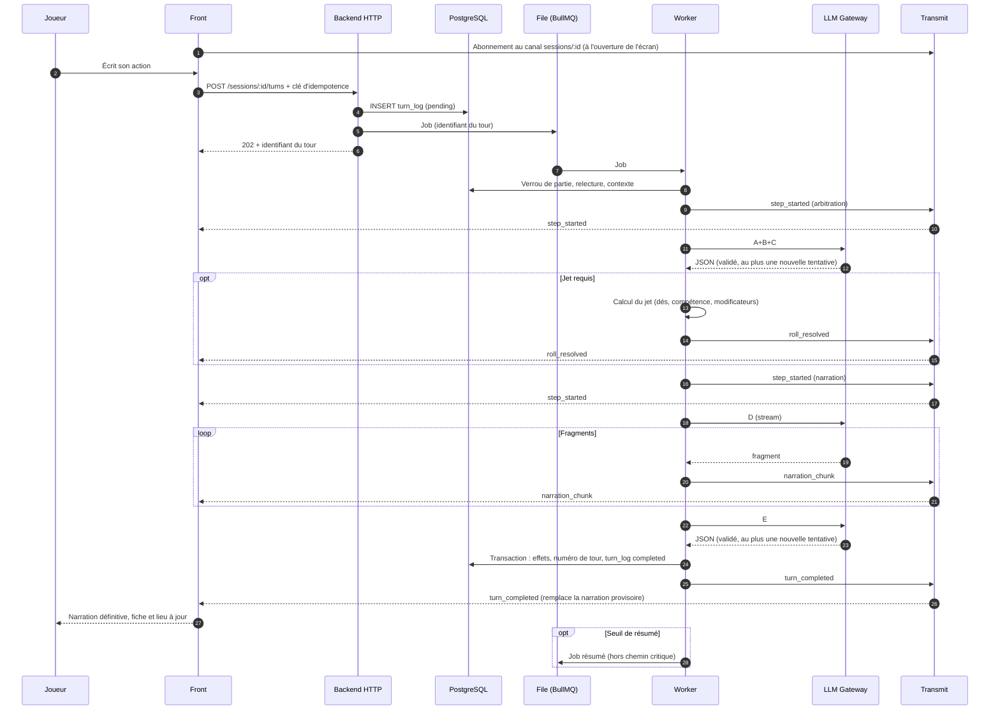

---

## 11. Déploiement cible

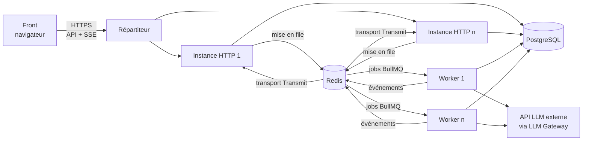

- **Workers séparés des process HTTP**, file BullMQ sur Redis [archi §8bis].
- **Transport Redis de Transmit** : un événement émis par un worker atteint le client SSE,
  quelle que soit l'instance HTTP qui tient sa connexion.
- **Verrou PostgreSQL par `session_id`** pour sérialiser les tours d'une même partie entre
  workers.
- Le passage à cette topologie est prévu avant le beta test (Phase 9) ; jusque-là, un seul
  process tient HTTP et worker, avec pg-boss et Transmit en mémoire.

---

## 12. Ce que ce document ne tranche pas

Repris des points ouverts des autres documents, sans les résoudre :

- **Chiffrage des modificateurs contextuels** : valeur proposée par le LLM (règles §5.1) ou
  label qualitatif converti par le backend (principe « le LLM ne manipule jamais de valeur
  numérique » du document de base de données) — Phase 4.
- **Schéma de l'inventaire** (`stackable`, détenteur d'un objet, durabilité, charges) — Phase 4.
- **Seuils de déclenchement du résumé narratif** — Phase 7.
- **Conditions de fin de partie et jets opposés contre un PNJ improvisé** — Phase 8.
- **Modération de contenu** au-delà du prompt injection — Phase 9.
- **Versionning des prompts** et différenciation du modèle par étape — Phase 9.
- **Battement de cœur SSE** (`pingInterval`) à régler selon l'hébergement retenu.
- **Hébergement** définitif.
